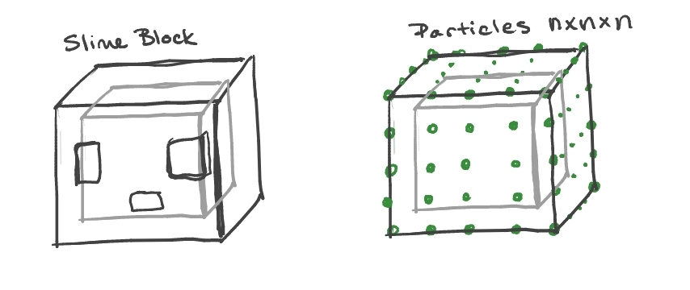

## Minecraft Slime Block - Mass Spring Simulation - Rebecca McFadden

### Proposal
-------
The general idea for this project is to create an `n x n x n` cube of particles connected by springs to simulate a jello-like substance. I plan to start with the Assignment 5 starter code and re-do the cloth to be a cube of particles - rendering only the outer facing vertices. Particles in the cube will be connected with structural, shear, and bending springs (just more than with the cloth).

I have a few ideas for expanding on this idea for increased interactivity. The first is to introduce an upward force on particles at the bottom of the cube when the spacebar is pressed to make the slime "jump". The second would be to spawn a sphere or other object to collide with the slime on a different key press.

The third idea aims to more closely resemble what the slime is meant to be. Slimes have an outer layer that is more transparent and less rigid than the inner more opaque layer. I believe I can go about this one of two ways depicted below.

 

The first would be to use a slime block mesh and approximate the vertex positions based on their original distances to each of the nearest particles in the cube. The slime block mesh could then be rendered with the appropriate texture and alpha map to make the outer layer transparent and the inner layer opaque. The second option is to carve an `m x m x m` cube from the inside of the original cube and add these particles as vertices of a second "mesh" with the same outward facing normals. I could then use two separate textures and corresponding alpha values to render the "two" meshes. The downside with this approach is that I would lose the additional cubes that make up the eyes and face of the slime, but it may be more feasible than the first option.

 
 
 

### Progress Update 12/4/2021
-----
The general idea for this project was to create an `n x n x n` cube of particles connected by springs to simulate a Minecraft Slime which has a jello-like structure. I started with the Assignment 5 starter code and re-worked the cloth to be a cube of particles. I chose the second option I discussed - rendering only the outer facing vertices and an inner cube of outer facing vertices since slimes have an outer layer that is more transparent. 

I constructed triangles from the vertices for each face, computed cross products to find the normals, and used linear interpolation to determine the texture coordinates of each vertex.  

Particles in the cube are connected with structural, shear, and bending springs (just more than with the cloth). The forces at each time step are calculated in the same way as A5. I apply an upward collision force if the slime collides with the floor using the same formula as with the sphere and the cloth but with the normal being `(0, 1, 0)`.

<figure align="center">

 
<figcaption>
Jumping sequence for the slime
</figcaption>
</figure>

I also made it possible for the slime to jump by applying an upward force to all vertices if the slime is touching the ground and the spacebar is pressed. Then, using the positions of the corner particles, I determined which way the right, top, and forward faces were facing and apply a forward, left, right, or backward motion if `w`, `a`, `s`, or `d` keys are pressed. 

With this extra movement, I ran into an issue where the springs would invert (a). I attempted a fix for this where I added structural springs connecting each of the 8 outer corners of the cube. While this was somewhat successful at preventing collapse if the cube was headed straight down or reshaping the cube if it hit lightly on the corner or edge, it produced the same collapsing issue if the hit was sufficiently hard. It also produced an odd look at the corners when the slime collided with the plane. I did also attempt to add shear springs for these 8 vertices, but this produced similar artifacts. 

Going forward, I still need to add collision with a bounding cube or possibly inclined planes. I also plan to enable some multithreading to speed up calculations and hopefully get better performance on my laptop for a smaller timestep.